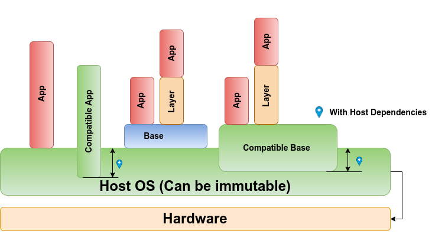

# Flake Pilot

## Semi-transparent Container/VM instances

1. [Introduction](#introduction)
    1. [Use Cases](#usecases)
2. [Installation](#installation)
3. [Quick Start OCI containers](#oci)
4. [Quick Start FireCracker VMs](#fire)
    1. [Use FireCracker VM image from components](#components)
    2. [Networking](#networking)
5. [Application Setup](#setup)
6. [How To Build Your Own App Images](#images)

## Introduction <a name="introduction"/>

Flake Pilot is software to register, provision, and launch applications
that are actually provided inside a runtime environment like an
OCI container or a Firecracker VM. There are two main components:

1. The launchers

   The launcher binary. Each application that was registered as a
   flake is redirected to a launcher binary. As of today,
   support for the ```podman``` and ```firecracker``` engines is
   implemented, leading to the respective ```podman-pilot``` and
   ```firecracker-pilot``` launcher binaries.

2. The flake registration tool

   ```flake-ctl``` is the management utility to list, register,
   remove, and more... flake applications on your host.

The main idea for Flake Pilot was not only to launch isolated apps like
native binaries but also to allow running a provisioning step prior to calling
the application. This concept then allows running semi-transparent
container/VM instances which can take information from other places
prior to their execution. The following diagram visualizes this concept:



As a result, we see some interesting use cases described in the following
section.

### Use Cases <a name="usecases"/>

* Delta containers used together with a base container such that
  only small delta containers are pulled to the registry, used with
  a base that exists only once.

* Include arbitrary data without harming host integrity, e.g., custom
  binaries, proprietary software not following package guidelines and
  standards (e.g., automotive industry processes which we will not be
  able to change in this life).

* Layering of several containers, e.g., deltas on top of a base. Building
  a solution stack, e.g., base + python + python-app.

* Provisioning app dependencies from the host instead of providing them
  in the container, e.g., a delta container providing the app using a base
  container but taking the certificates or other sensitive information
  from the host; a three-way dependency model.

* Isolating applications that require different library versions
  than those the host provides, e.g., old legacy applications.

* Running AI workloads in isolated environments.

Actually, some of the above use cases are immaterial if proper packaging,
release, and maintenance of the application are possible. However, I have
learned the world is not an ideal place, and there might be a spot for
this project to be useful, supporting users with "special" needs and
adding an adaptive feature to the OS.

For demo purposes and to showcase the mentioned use cases, some
example images were created. See [How To Build Your Own App Images](#images)
for further details

## Installation <a name="installation"/>

Flake Pilot components are written in Rust and are available as packages
for SUSE as follows:

```bash
zypper addrepo https://download.opensuse.org/repositories/home:/marcus.schaefer:/EOS/TW/
zypper install flake-pilot flake-pilot-podman flake-pilot-firecracker
```

Manual compilation and installation can be done as follows:

```bash
make build && make install
```

## Quick Start OCI containers <a name="oci"/>

To start, let's register an application named ```aws``` which is
connected to the ```aws-cli``` container provided by Amazon on
```docker.io/amazon```.

1. Pull the container

   ```bash
   flake-ctl podman pull --uri docker.io/amazon/aws-cli
   ```

2. Register the ```aws``` application

   ```bash
   flake-ctl podman register --container amazon/aws-cli --app /usr/bin/aws --target /
   ```

   This creates ```/usr/bin/aws``` on your host, which actually
   launches the ```amazon/aws-cli``` container. The default entry
   point of the container was configured by Amazon to launch their
   cloud API application. Thus, the target program to call inside
   the container doesn't need to be explicitly configured in
   the registration and is therefore just set to ```/```.

3. Launch the application

   To run ```aws```, just call, for example:

   ```bash
   aws ec2 help
   ```

Let's register an editor application next. The following example uses
the ```joe``` editor flake, which was produced as a delta container
against the ```basesystem``` container.

1. Register the ```joe``` application

   ```bash
   flake-ctl podman register \
       --app /usr/bin/joe \
       --container registry.opensuse.org/home/marcus.schaefer/delta_containers/containers_tw/joe \
       --base registry.opensuse.org/home/marcus.schaefer/delta_containers/containers_tw/basesystem \
       --target /usr/bin/joe
   ```

2. Launch the application

   To run the ```joe``` editor, just call:

   ```bash
   joe
   ```

This example also shows that it's not required to explicitly pull the
required containers. At launch time, missing containers will be pulled
automatically.

## Quick Start FireCracker VMs <a name="fire"/>

Using containers to isolate applications from the host system is a common
approach. The limitation is at the kernel level. Each container
shares the kernel with the host, and if an application requires to run
privileged, requires direct access to device nodes or kernel interfaces
like the device mapper, a deeper level of isolation may be needed.
At this point, full virtual system instances running their own kernel, optional
initrd, and processes inside provide a solution. The trade-off is performance,
but projects like KVM and Firecracker offer a nice
concept to run virtual machines accelerated through KVM as a competitive
alternative to containers. Thus, Flake Pilot also implements support for the
Firecracker engine.

Start an application as a virtual machine (VM) instance as follows:

1. Pull a Firecracker-compatible VM

   ```bash
   flake-ctl firecracker pull --name leap \
       --kis-image https://download.opensuse.org/repositories/home:/marcus.schaefer:/delta_containers/images_leap/firecracker-basesystem.$(uname -m).tar.xz
   ```

2. Register the ```mybash``` application

   ```bash
   flake-ctl firecracker register --vm leap \
       --app /usr/bin/mybash --target /bin/bash --overlay-size 20GiB
   ```

   This registers an app named ```mybash``` to the system. Once called, a
   Firecracker VM based on the pulled ```leap``` image is started, and
   the ```/bin/bash``` program is called inside the VM instance.
   In addition, some write space of 20GB is added to the instance.

3. Launch the application

   To run ```mybash```, just call, for example:

   ```bash
   mybash
   ```

   This drops you into a bash shell inside the VM.

   **_NOTE:_** Data transfer from the virtual machine to the host
   is done through the serial console. As the process of calling the
   application includes the boot of the virtual machine, kernel messages
   may be intermixed with the output of the application.
   Our default setting prevents kernel messages from being printed to
   the console as much as possible, but there are messages that can hardly
   be prevented or require a customized kernel build to be suppressed.
   If this is unwanted, use the

   ```bash
   --force-vsock
   ```

   option when registering the application.

   There are still limitations, such as no differentiation between **stdout**
   and **stderr** anymore, and the exit code of the VM call does not match
   the exit code of the application call.


### Use Firecracker VM image from components <a name="components"/>

In the quickstart for Firecracker, a special image type called ```kis-image```
was used. This image type is specific to the KIWI appliance builder, and
it provides the required components to boot up a Firecracker VM in one
archive. However, it's also possible to pull a Firecracker VM image from
its single components. Mandatory components are the kernel image and the
rootfs image, whereas the initrd is optional. The Firecracker project
itself provides its images in single components, and you can use them
as follows:

1. Pull a firecracker compatible VM

   ```bash
   flake-ctl firecracker pull --name firecore \
       --rootfs https://s3.amazonaws.com/spec.ccfc.min/ci-artifacts/disks/$(uname -m)/ubuntu-18.04.ext4 \
       --kernel https://s3.amazonaws.com/spec.ccfc.min/img/quickstart_guide/$(uname -m)/kernels/vmlinux.bin
    ```

2. Register the ```fireshell``` application

   ```bash
   flake-ctl firecracker register \
       --app /usr/bin/fireshell --target /bin/bash --vm firecore --no-net
   ```

3. Launch the application

   To run ```fireshell``` just call for example:

   ```bash
   fireshell -c "'ls -l'"
   ```

### Networking <a name="networking"/>

As of today, Firecracker supports networking only through TUN/TAP devices.
As a consequence, it is the user's responsibility to set up the routing on the
host from the TUN/TAP device to the outside world. There are many possible
solutions available, and the following describes a simple static IP and NAT-based setup.

The proposed example works within the following requirements:

*   `initrd_path` must be set in the flake configuration.
*   The used initrd has to provide support for `systemd-(networkd, resolved)`
    and must have been created by `dracut` such that the passed
    `boot_args` in the flake setup will become effective.

1. Enable IP forwarding

   ```bash
   sudo sh -c "echo 1 > /proc/sys/net/ipv4/ip_forward"
   ```

2. Set up NAT on the outgoing interface

   Network Address Translation (NAT) is an easy way to route traffic
   to the outside world even when it originates from another network.
   All traffic appears as if it would come from the outgoing
   interface.

   **_NOTE:_** Please check which tool is managing the firewall on
   your host and refer to its documentation on how to set up the
   NAT/postrouting rules. The information below assumes there is no
   other firewall software active on your host and serves only as
   an example setup!

   In this example, we assume ```eth0``` to be the outgoing interface:

   ```bash
   sudo iptables -t nat -A POSTROUTING -o eth0 -j MASQUERADE
   sudo iptables -A FORWARD -m conntrack --ctstate RELATED,ESTABLISHED -j ACCEPT
   ```

3. Set up network configuration in the flake setup

   The flake configuration for the registered ```mybash``` app from
   above can be found at:

   ```bash
   vi /usr/share/flakes/mybash.yaml
   ```

   The default network setup is based on DHCP because this is
   the only generic setting that `flake-ctl` offers at the moment.
   The setup offered for networking provides the setting
   ```ip=dhcp```. Change this setting to the following:

   ```yaml
   vm:
     runtime:
       firecracker:
         boot_args:
           - ip=172.16.0.2::172.16.0.1:255.255.255.0::eth0:off
           - rd.route=172.16.0.1/24::eth0
           - nameserver=8.8.8.8
   ```

   In this example, the DHCP-based setup changes to a static
   IP: 172.16.0.2 using 172.16.0.1 as its gateway, and Google
   to perform name resolution. Please note: The name of the
   network interface in the guest is always ```eth0```. For
   further information about network setup options, refer
   to ```man dracut.cmdline``` and look up the section
   about ```ip=```.

4. Create a TAP device matching the app registration. In the above example,
   the app ```/usr/bin/mybash``` was registered. The Firecracker pilot
   configures the VM instance to pass traffic on the TAP device named
   ```tap-mybash```. If the application is called with an identifier like
   ```mybash @id```, the TAP device name ```tap-mybash@id``` is used.

   ```bash
   sudo ip tuntap add tap-mybash mode tap
   ```

   **_NOTE:_** If the TAP device does not exist, `firecracker-pilot` will
   create it for you. However, this may be too late in the case of, for example, a
   DHCP setup which requires the routing of the TAP device to be present
   before the actual network setup inside the guest takes place.
   If `firecracker-pilot` creates the TAP device, it will also be
   removed if the instance shuts down.

5. Connect the TAP device to the outgoing interface

   Select a subnet range for the TAP and bring it up.

   **_NOTE:_** The settings here must match the flake configuration!

   ```bash
   ip addr add 172.16.0.1/24 dev tap-mybash
   ip link set tap-mybash up
   ```

   Forward TAP to the outgoing interface

   ```bash
   sudo iptables -A FORWARD -i tap-mybash -o eth0 -j ACCEPT
   ```

6. Start the application

   ```bash
   mybash

   $ ip a
   $ ping www.google.de
   ```

   **_NOTE:_** The TAP device cannot be shared across multiple instances.
   Each instance needs its own TAP device. Thus, steps 3, 4, and 5 need
   to be repeated for each instance.

## Application Setup <a name="setup"/>

After an application is registered, it can be listed via:

```bash
flake-ctl list
```

Each application provides a configuration below ```/usr/share/flakes/```.
The term ```flake``` is a short name for an application running inside an isolated environment.
For our above registered ```aws``` flake, the config file structure
looks like the following:

```
/usr/share/flakes/
├── aws.d
└── aws.yaml
```

Please consult the manual pages for detailed information
about the contents of the flake setup.

https://github.com/OSInside/flake-pilot/tree/main/doc

## How To Build Your Own App Images <a name="images"/>

Building images as container or VM images can be done in different ways.
One option is to use the **Open Build Service**, which is able to build
software packages and images and therefore allows maintaining the
complete application stack.

For demonstration purposes and to showcase the mentioned [Use Cases](#usecases),
some example images were created and could be considered a simple
```flake store```. Please find them here:

* https://build.opensuse.org/project/show/home:marcus.schaefer:delta_containers

Feel free to browse through the project and have some fun testing. There
is a short description for each application on how to use them.

**_NOTE:_** All images are built using the
[KIWI](https://github.com/OSInside/kiwi) appliance builder, which is
supported by the Open Build Service backend and allows building all the
images in a maintainable way. KIWI uses an image description format
to describe the image in a declarative way. Reading the above
examples should give you an idea of how things fit together. If you have any questions
regarding KIWI and the image builds, please contact us.

Flake Pilot is a project in its early stages. Feedback
is very much welcome.

