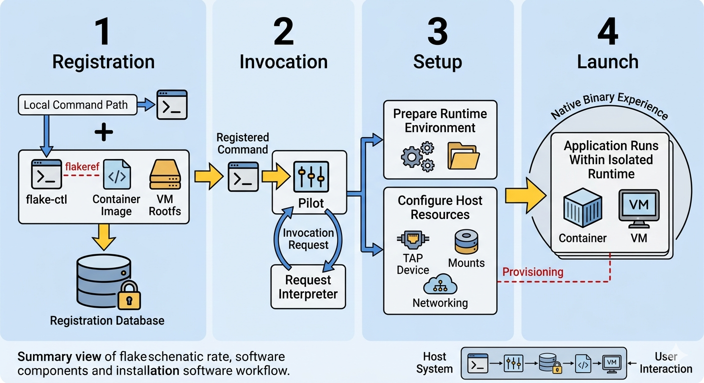

# Flake Pilot

## Application Isolation - Secure Execution with a Native Feel

1. [Introduction](#introduction)
    1. [Use Cases](#usecases)
2. [Installation](#installation)
3. [Examples](#examples)
    1. [Register Amazon's SDK utility as a container app named: aws](#one)
    2. [Register an editor app as a delta container named: joe](#two)
    3. [Register gemini AI as a container app named: ok-google](#three)
    4. [Register a shell as a firecracker VM app named: fireshell](#four)
    5. [Register claude AI as firecracker VM app named: claude](#five)
        1. [Firecracker Networking](#networking)
4. [Application Setup](#setup)
5. [How To Build Your Own App Images](#images)

## Introduction <a name="introduction"/>

Flake Pilot is software to register, provision, and launch applications
that are actually provided inside a runtime environment like an
OCI container or a Firecracker VM.



There are two main components:

1. The launchers

   The launcher binary. Each application that was registered as a
   flake is redirected to a launcher binary. As of today,
   support for the ```podman``` and ```firecracker``` engines is
   implemented, leading to the respective ```podman-pilot``` and
   ```firecracker-pilot``` launcher binaries.

2. The flake registration tool

   ```flake-ctl``` is the management utility to list, register,
   remove, and more... flake applications on your host.

### Use Cases <a name="usecases"/>

* Running AI workloads in isolated environments.

* Delta containers used together with a base container such that
  only small delta containers are pulled to the registry, used with
  a base that exists only once.

* Include arbitrary data without harming host integrity, e.g., custom
  binaries, proprietary software not following package guidelines and
  standards.

* Layering of several containers, e.g., deltas on top of a base. Building
  a solution stack, e.g., base + python + python-app.

* Provisioning app dependencies from the host instead of providing them
  in the container, e.g., a delta container providing the app using a base
  container but taking the certificates or other sensitive information
  from the host; a three-way dependency model.

* Isolating applications that require different library versions
  than those the host provides, e.g., old legacy applications.

* and maybe more...

## Installation <a name="installation"/>

Flake Pilot components are written in Rust and are available as
packages here: https://build.opensuse.org/package/show/Virtualization:Appliances:Builder/flake-pilot. Install the following packages:

* flake-pilot
* flake-pilot-podman
* flake-pilot-firecracker

Manual compilation and installation can be done as follows:

```bash
make build && make install
```

## Examples <a name="examples"/>

To get started with flake-pilot, try running one or more of these examples.
All apps will be registered in the users home directory. Therefore it's
handy to add that path to the environment:

```bash
export PATH=$PATH:$HOME
```

### Register Amazon's SDK utility as a container app named: aws <a name="one"/>

```bash
flake-ctl podman --user register \
     --container docker.io/amazon/aws-cli --app $HOME/aws --target /

aws ec2 help
```

This creates ```$HOME/aws``` on your host, which actually
launches the ```amazon/aws-cli``` container. The default entry
point of the container was configured by Amazon to launch their
cloud API application. Thus, the target program to call inside
the container doesn't need to be explicitly configured in
the registration and is therefore just set to ```/```.
The call of ```aws ec2 help``` launches an instance of the
container via rootless podman and shows the help text for
the ```ec2``` subcommand.

### Register an editor app as a delta container named: joe <a name="two"/>

```bash
flake-ctl podman register \
    --app $HOME/joe \
    --container registry.opensuse.org/home/marcus.schaefer/delta_containers/containers_tw/joe \
    --base registry.opensuse.org/home/marcus.schaefer/delta_containers/containers_tw/basesystem \
    --target /usr/bin/joe

joe
```

This creates ```$HOME/joe``` which is a simple but nice editor. The launch
of the container requires a provision step in which the base container gets
mounted and the delta container is layered on top of it. This action
unfortunately requires root privileges and is forwarded to the system's
```sudo``` binary.

### Register gemini AI as a container app named: ok-google <a name="three"/>

```bash
mkdir -p ~/ai

flake-ctl podman --user register \
    --app $HOME/ok-google \
    --target /usr/local/bin/gemini \
    --container public.ecr.aws/b9k1j9y6/ai/gemini:latest \
    --resume \
    --opt "\--net host" \
    --opt "\--interactive" \
    --opt "\--workdir /root/ai" \
    --opt "\--volume %HOME/ai:/root/ai" \
    --opt "\-e GEMINI_API_KEY=YOUR_KEY_HERE"

ok-google "What is the capital of Germany?"
```

This pulls the gemini container from the ai space of a public ECR
which we use to offer nightly builds of the most popular AI tools.
The gemini API key can be added as an environment option to this
container such that on startup the authentication is already in
place. The app registration uses the mounted volume to store its
data persistently on the hosts ```~/ai``` directory.

**_NOTE:_** for deeper isolation consider to use ```krun``` instead
of the default podman runtime. To activate krun pass the option
```--opt "\--runtime=krun"``` to the flake registration. krun uses
KVM virtualization and therefore provides a deeper isolation than the
default namespaces-based isolation of podman.

### Register a shell as a firecracker VM app named: fireshell <a name="four"/>

```bash
sudo flake-ctl firecracker pull --name leap \
    --kis-image https://download.opensuse.org/repositories/home:/marcus.schaefer:/delta_containers/images_leap/firecracker-basesystem.$(uname -m).tar.xz

flake-ctl firecracker register --vm leap \
    --app $HOME/fireshell --target /bin/bash --overlay-size 20GiB

fireshell
```

This registers an app named ```fireshell``` to the system. Once called, a
Firecracker VM, based on the pulled ```leap``` image, is started and
drops you into a bash shell. In addition, some write space of 20GB is
added to the instance.

**_NOTE:_** Data transfer from the virtual machine to the host
is done through the serial console. Alternatively a vsock based
communication can be used. To do this specify the
option ```--force-vsock``` when registering the application.

### Register claude AI as firecracker VM app named: claude <a name="five"/>

```bash
sudo flake-ctl firecracker pull --name claude \
    --kis-image https://github.com/OSInside/flake-pilot/raw/refs/heads/main/appstore/firecracker/claude.x86_64-1.15.6-0.tar.xz

flake-ctl firecracker register --vm claude \
    --app $HOME/claude --target /usr/local/bin/claude \
    --overlay-size 20GiB --force-vsock --resume

claude --version
```

This registers an app named ```claude``` to the system. Once called, a
Firecracker VM, based on the pulled ```claude``` image, is started and
executes the ```claude``` binary. The communication is vsock based and the
VM instance is kept alive after the execution of the target program, which
allows for further calls to the same instance.

#### Firecracker Networking <a name="networking"/>

As of today, Firecracker supports networking only through TUN/TAP devices.
As a consequence, it is the user's responsibility to set up the routing on the
host from the TUN/TAP device to the outside world. There are many possible
solutions available, and the following describes a simple static IP and NAT-based setup.

The proposed example works within the following requirements:

*   `initrd_path` must be set in the flake configuration.
*   The used initrd has to provide support for `systemd-(networkd, resolved)`
    and must have been created by `dracut` such that the passed
    `boot_args` in the flake setup will become effective.

1. Enable IP forwarding

   ```bash
   sudo sh -c "echo 1 > /proc/sys/net/ipv4/ip_forward"
   ```

2. Set up NAT on the outgoing interface

   Network Address Translation (NAT) is an easy way to route traffic
   to the outside world even when it originates from another network.
   All traffic appears as if it would come from the outgoing
   interface.

   **_NOTE:_** Please check which tool is managing the firewall on
   your host and refer to its documentation on how to set up the
   NAT/postrouting rules. The information below assumes there is no
   other firewall software active on your host and serves only as
   an example setup!

   In this example, we assume ```eth0``` to be the outgoing interface:

   ```bash
   sudo iptables -t nat -A POSTROUTING -o eth0 -j MASQUERADE
   sudo iptables -A FORWARD -m conntrack --ctstate RELATED,ESTABLISHED -j ACCEPT
   ```

3. Set up network configuration in the flake setup

   The flake configuration for the registered ```claude``` app from
   above can be found at:

   ```bash
   vi /usr/share/flakes/claude.yaml
   ```

   The default network setup is based on DHCP because this is
   the only generic setting that `flake-ctl` offers at the moment.
   The setup offered for networking provides the setting
   ```ip=dhcp```. Change this setting to the following:

   ```yaml
   vm:
     runtime:
       firecracker:
         boot_args:
           - ip=172.16.0.2::172.16.0.1:255.255.255.0::eth0:off
           - rd.route=172.16.0.1/24::eth0
           - nameserver=8.8.8.8
   ```

   In this example, the DHCP-based setup changes to a static
   IP: 172.16.0.2 using 172.16.0.1 as its gateway, and Google
   to perform name resolution. Please note: The name of the
   network interface in the guest is always ```eth0```. For
   further information about network setup options, refer
   to ```man dracut.cmdline``` and look up the section
   about ```ip=```.

4. Create a TAP device matching the app registration. In the above example,
   the app ```$HOME/claude``` was registered. The Firecracker pilot
   configures the VM instance to pass traffic on the TAP device named
   ```tap-claude```. If the application is called with an identifier like
   ```claude @id```, the TAP device name ```tap-claude@id``` is used.

   ```bash
   sudo ip tuntap add tap-claude mode tap
   ```

   **_NOTE:_** If the TAP device does not exist, `firecracker-pilot` will
   create it for you. However, this may be too late in the case of, for example, a
   DHCP setup which requires the routing of the TAP device to be present
   before the actual network setup inside the guest takes place.
   If `firecracker-pilot` creates the TAP device, it will also be
   removed if the instance shuts down.

5. Connect the TAP device to the outgoing interface

   Select a subnet range for the TAP and bring it up.

   **_NOTE:_** The settings here must match the flake configuration!

   ```bash
   ip addr add 172.16.0.1/24 dev tap-claude
   ip link set tap-claude up
   ```

   Forward TAP to the outgoing interface

   ```bash
   sudo iptables -A FORWARD -i tap-claude -o eth0 -j ACCEPT
   ```

   **_NOTE:_** The TAP device cannot be shared across multiple instances.
   Each instance needs its own TAP device. Thus, steps 3, 4, and 5 need
   to be repeated for each instance.

## Application Setup <a name="setup"/>

After an application is registered, it can be listed via:

```bash
flake-ctl list
```

Each application provides a configuration below ```/usr/share/flakes/```.
The term ```flake``` is a short name for an application running inside an isolated environment.
For our above registered ```aws``` flake, the config file structure
looks like the following:

```
/usr/share/flakes/
├── aws.d
└── aws.yaml
```

Please consult the manual pages for detailed information
about the contents of the flake setup.

https://github.com/OSInside/flake-pilot/tree/main/doc

## How To Build Your Own App Images <a name="images"/>

Building images as container or VM images can be done in different ways.
One option is to use the **Open Build Service** with [KIWI](https://github.com/OSInside/kiwi),
which is able to build software packages and images and therefore
allows maintaining the complete application stack.

For demonstration purposes and to showcase the mentioned [Use Cases](#usecases),
some example images were created and can serve as examples to build
your own images as you see fit. Please find the image descriptions used
in the context of this documentation here:

* https://build.opensuse.org/project/show/home:marcus.schaefer:delta_containers
* https://github.com/OSInside/flake-pilot/tree/main/appstore/firecracker
* https://github.com/OSInside/flake-pilot/tree/main/appstore/podman (https://gallery.ecr.aws/b9k1j9y6?page=1)

Feedback is very much welcome.
