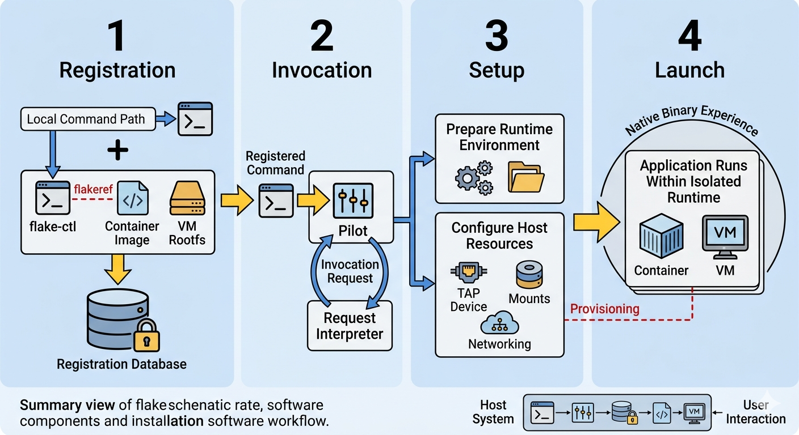
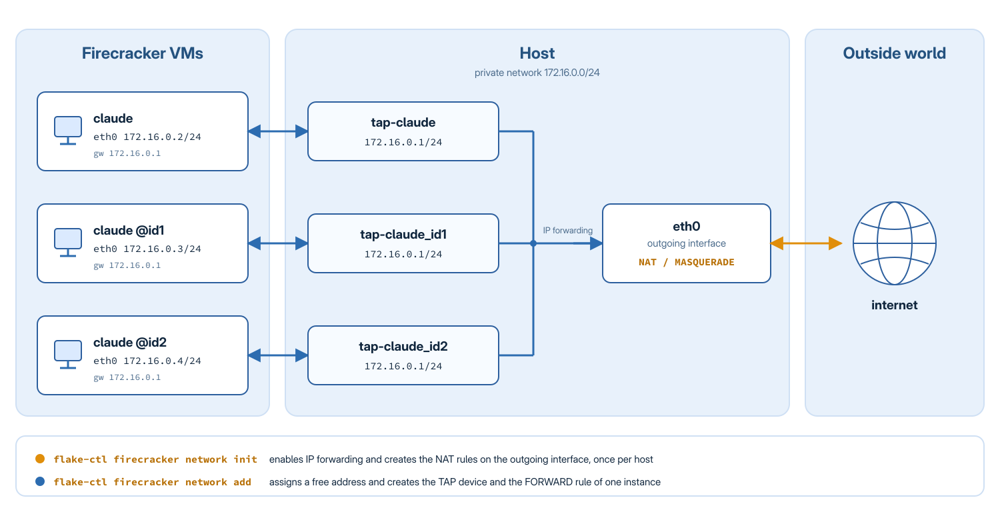

# Flake Pilot

## Application Isolation - Secure Execution with a Native Feel

1. [Introduction](#introduction)
    1. [Use Cases](#usecases)
2. [Installation](#installation)
3. [Examples](#examples)
    1. [Register Amazon's SDK utility as a container app named: aws](#one)
    2. [Register an editor app as a delta container named: joe](#two)
    3. [Register claude AI as a container app named: claude](#three)
    4. [Register a shell as a firecracker VM app named: fireshell](#four)
    5. [Register claude AI as firecracker VM app named: claude](#five)
        1. [Firecracker Networking](#networking)
            1. [The Concept](#networking-concept)
            2. [The Commands](#networking-commands)
            3. [The Result in the Flake Configuration](#networking-config)
4. [Application Setup](#setup)
5. [How To Build Your Own App Images](#images)
6. [Known Issues](#issues)

## Introduction <a name="introduction"/>

Flake Pilot is software to register, provision, and launch applications
that are actually provided inside a runtime environment like an
OCI container or a Firecracker VM.



There are two main components:

1. The launchers

   The launcher binary. Each application that was registered as a
   flake is redirected to a launcher binary. As of today,
   support for the ```podman``` and ```firecracker``` engines is
   implemented, leading to the respective ```podman-pilot``` and
   ```firecracker-pilot``` launcher binaries.

2. The flake registration tool

   ```flake-ctl``` is the management utility to list, register,
   remove, and more... flake applications on your host.

### Use Cases <a name="usecases"/>

* Running AI workloads in isolated environments.

* Delta containers used together with a base container such that
  only small delta containers are pulled to the registry, used with
  a base that exists only once.

* Include arbitrary data without harming host integrity, e.g., custom
  binaries, proprietary software not following package guidelines and
  standards.

* Layering of several containers, e.g., deltas on top of a base. Building
  a solution stack, e.g., base + python + python-app.

* Provisioning app dependencies from the host instead of providing them
  in the container, e.g., a delta container providing the app using a base
  container but taking the certificates or other sensitive information
  from the host; a three-way dependency model.

* Isolating applications that require different library versions
  than those the host provides, e.g., old legacy applications.

* and maybe more...

## Installation <a name="installation"/>

Flake Pilot components are written in Rust and are available as
packages here: https://build.opensuse.org/package/show/Virtualization:Appliances:Builder/flake-pilot. Install the following packages:

* flake-pilot
* flake-pilot-podman
* flake-pilot-firecracker

Manual compilation and installation can be done as follows:

```bash
make build && make install
```

## Examples <a name="examples"/>

To get started with flake-pilot, try running one or more of these examples.
All apps will be registered in the users home directory. Therefore it's
handy to add that path to the environment:

```bash
mkdir -p ~/bin
export PATH=$PATH:$HOME/bin
```

The examples register the apps for the calling user. flake-ctl
detects this mode from the caller, every command called as a
user other than root operates on the setup of that user. The
setup for this rootless mode is created once via:

```bash
flake-ctl init
```

### Register Amazon's SDK utility as a container app named: aws <a name="one"/>

```bash
flake-ctl podman register \
     --container docker.io/amazon/aws-cli --app $HOME/bin/aws --target /

aws ec2 help
```

This creates ```$HOME/aws``` on your host, which actually
launches the ```amazon/aws-cli``` container. The default entry
point of the container was configured by Amazon to launch their
cloud API application. Thus, the target program to call inside
the container doesn't need to be explicitly configured in
the registration and is therefore just set to ```/```.
The call of ```aws ec2 help``` launches an instance of the
container via rootless podman and shows the help text for
the ```ec2``` subcommand.

### Register an editor app as a delta container named: joe <a name="two"/>

```bash
flake-ctl podman register \
    --app $HOME/bin/joe \
    --container registry.opensuse.org/home/marcus.schaefer/delta_containers/containers_tw/joe \
    --base registry.opensuse.org/home/marcus.schaefer/delta_containers/containers_tw/basesystem \
    --target /usr/bin/joe

joe
```

This creates ```$HOME/joe``` which is a simple but nice editor. The launch
of the container requires a provision step in which the base container gets
mounted and the delta container is layered on top of it. This action
unfortunately requires root privileges and is forwarded to the system's
```sudo``` binary.

### Register claude AI as a container app named: claude <a name="three"/>

```bash
mkdir -p ~/ai

flake-ctl podman register \
    --app $HOME/bin/claude \
    --target /bin/bash \
    --container public.ecr.aws/b9k1j9y6/ai/claude:latest \
    --resume \
    --opt "\--net host" \
    --opt "\-ti" \
    --opt "\--workdir %HOME/ai" \
    --opt "\--volume %HOME/ai:%HOME/ai" \
    --opt "\-e HOME=%HOME"

claude
```

This pulls the claude container from the ai space of a public ECR
which we use to offer nightly builds of the most popular AI tools.
The registered flake just starts an isolated shell if you call: claude.
further calls of claude will run in the same container instance due to
the --resume option. The ai directory is the only path shared from the
host with the container.

**_NOTE:_** For deeper isolation based on a VM you can either use
the firecracker pilot from flake-pilot or the krun runtime with podman
which gives isolation based on KVM and should be preferred for AI workloads.
Please make sure to install the ```crun``` package which also provides krun.
The krun OCI handler however, does not support the exec command. This
limitation exists because libkrun runs workloads inside isolated microVMs,
and there is no built-in mechanism or agent inside the lightweight
virtual machine to spawn and inject new secondary processes. Because
of this a krun based app registration cannot use the **resume** feature
and looks as follows:

```bash
flake-ctl podman register \
    --app $HOME/bin/claude \
    --target /bin/bash \
    --container public.ecr.aws/b9k1j9y6/ai/claude:latest \
    --opt "\--net host" \
    --opt "\--runtime=krun" \
    --opt "\-ti" \
    --opt "\--workdir %HOME/ai" \
    --opt "\--volume %HOME/ai:%HOME/ai" \
    --opt "\-e HOME=%HOME"
```

To switch the podman runtime in a user or system wide scope create the file
```/etc/containers/containers.conf``` for a system wide setup or
```$HOME/.config/containers/containers.conf``` for a user specific
setup and place the following content:

```bash
[engine]
runtime = "krun"
```

### Register a shell as a firecracker VM app named: fireshell <a name="four"/>

```bash
flake-ctl firecracker pull --name leap \
    --kis-image https://github.com/OSInside/flake-pilot/raw/refs/heads/main/appstore/firecracker/leap.x86_64-1.15.6-0.tar.xz

flake-ctl firecracker register --vm leap --no-net \
    --app $HOME/bin/fireshell --target /bin/bash --overlay-size 20GiB

fireshell
```

This registers an app named ```fireshell``` to the system. Once called, a
Firecracker VM, based on the pulled ```leap``` image, is started and
drops you into a bash shell. In addition, some write space of 20GB is
added to the instance.

**_NOTE:_** Data transfer from the virtual machine to the host
is done through the serial console. Alternatively a vsock based
communication can be used. To do this specify the
option ```--force-vsock``` when registering the application.

### Register claude AI as firecracker VM app named: claude <a name="five"/>

```bash
flake-ctl firecracker pull --name claude \
    --kis-image https://github.com/OSInside/flake-pilot/raw/refs/heads/main/appstore/firecracker/claude.x86_64-1.15.6-0.tar.xz

flake-ctl firecracker register --vm claude \
    --app $HOME/bin/claude --target /bin/bash \
    --overlay-size 20GiB --force-vsock --resume

flake-ctl firecracker network init --outgoing-interface eth0
flake-ctl firecracker network add --app $HOME/bin/claude

claude
```

This registers an app named ```claude``` to the system. Once called, a
Firecracker VM, based on the pulled ```claude``` image, is started and
executes the ```bash``` shell. The communication is vsock based and the
VM instance is kept alive after the execution of the target program, which
allows for further calls to the same instance. In the shell, you can
setup access to claude AI for example through Google Vertex AI as follows:

```bash
export ANTHROPIC_VERTEX_PROJECT_ID=YOUR_PROJECT_ID
gcloud auth application-default login --project $ANTHROPIC_VERTEX_PROJECT_ID

claude
```

#### Firecracker Networking <a name="networking"/>

Firecracker connects a virtual machine to the outside world through a
TUN/TAP device only. Such a device is a host local endpoint and provides
no connection beyond the host by itself. Routing its traffic further is
the task of the host. `flake-pilot` implements this as a NAT based setup
with statically assigned addresses. It is created and deleted with the
```flake-ctl firecracker network``` commands, no manual setup is needed.

The setup works within the following requirements:

*   `initrd_path` must be set in the flake configuration.
*   The used initrd has to provide support for `systemd-(networkd, resolved)`
    and must have been created by `dracut` such that the passed
    `boot_args` in the flake setup will become effective.

##### The Concept <a name="networking-concept"/>

All VM applications of a host live in one private network which does not
exist outside of that host:

*   Private network: ```172.16.0.0/24```
*   Gateway, the host side of the network: ```172.16.0.1```
*   Netmask: ```255.255.255.0```
*   Name server: ```8.8.8.8```
*   Name of the network interface in the guest: ```eth0```

These values are compiled into ```flake-ctl``` and are not configurable.
Only the address of an application is variable. It is assigned once,
when the application is connected, and is written to its flake
configuration. Therefore an application keeps its address across calls
and across reboots of the host until it is disconnected again. The
address handed out is the lowest one of the private network which is
not used by another flake registration, addresses of applications which
were disconnected are handed out again.

Every instance of an application has its own address and its own TAP
device. The host side of each TAP device carries the gateway address,
the guest side is configured by the kernel of the VM from the ```ip=```
option on its commandline. No DHCP server is involved:



The traffic of an instance takes the following path:

1. The kernel of the VM configures ```eth0``` statically from its
   commandline and routes everything to the gateway ```172.16.0.1```,
   which is the host side of the TAP device the instance is connected to

2. IP forwarding on the host passes the packet from the TAP device on to
   the outgoing interface. One ```FORWARD``` rule per TAP device allows
   this

3. The NAT rule of the outgoing interface rewrites the sender address to
   the address of that interface. On the network of the host the traffic
   of the instance appears as if it would originate from the host itself

4. The answers are recognized by connection tracking and are routed back
   to the TAP device the connection came from

**_NOTE:_** The instances share the private network but they are not
connected to each other. There is no route between two TAP devices, the
only peer of an instance is the host.

**_NOTE:_** Only the address in the flake configuration is persistent.
IP forwarding, the netfilter rules and the TAP devices are runtime state
of the host, after a reboot they have to be created again.

##### The Commands <a name="networking-commands"/>

1. Prepare the host

   ```bash
   flake-ctl firecracker network init --outgoing-interface eth0
   ```

   Enables IP forwarding and creates the NAT rules on the given
   interface, the one the traffic of the VMs leaves the host through.
   This is done once per host, and again after a reboot, not once per
   application. The interface is recorded such that the following
   commands know where to route the traffic to.

   **_NOTE:_** Please check which tool is managing the firewall on
   your host and refer to its documentation on how to set up the
   NAT/postrouting rules. The command assumes there is no other
   firewall software active on your host and serves only as an
   example setup!

2. Connect an application

   ```bash
   flake-ctl firecracker network add --app $HOME/bin/claude
   ```

   Assigns a free address to the application, writes the network setup
   to its flake configuration, creates its TAP device and connects that
   device to the outgoing interface.

   As every instance needs its own address and its own TAP device, the
   command has to be called for each selector the application is called
   with:

   ```bash
   flake-ctl firecracker network add --app $HOME/bin/claude --instance @id1
   ```

3. Disconnect an application

   ```bash
   flake-ctl firecracker network remove --app $HOME/bin/claude
   ```

   Deletes the TAP device, its forwarding rule and the network setup in
   the flake configuration. The address becomes free for another
   application. Called with ```--instance``` only the setup of that
   instance is deleted. The host setup of step 1. is shared by all
   applications and stays in place.

   **_NOTE:_** The application is left without an ```ip=``` option,
   which is the same state a registration with the ```--no-net```
   option creates. If the VM should fall back to a dynamic
   setup, ```ip=dhcp``` has to be added to its ```boot_args``` by hand.

All commands change the network configuration of the host and therefore
call the required ```ip``` and ```iptables``` commands through
```sudo```. They can be called more than once: a device or a rule which
is already there is not created twice, and one which is gone is not
deleted again. After a reboot of the host, calling ```init``` and
```add``` again restores the setup with the same addresses.

##### The Result in the Flake Configuration <a name="networking-config"/>

The flake configuration for the registered ```claude``` app from above
can be found at:

```bash
vi ~/.config/flakes/claude.yaml
```

Connecting the app and its instances leads to the following network
related settings:

```yaml
vm:
  runtime:
    firecracker:
      boot_args:
        - ip=172.16.0.2::172.16.0.1:255.255.255.0::eth0:off
        - rd.route=172.16.0.1/24::eth0
        - nameserver=8.8.8.8
      instance:
        "@id1":
          boot_args:
            - ip=172.16.0.3::172.16.0.1:255.255.255.0::eth0:off
        "@id2":
          boot_args:
            - ip=172.16.0.4::172.16.0.1:255.255.255.0::eth0:off
```

With this setup ```claude``` boots with the static IP 172.16.0.2,
```claude @id1``` with 172.16.0.3 and ```claude @id2``` with 172.16.0.4.
For further information about the network setup options, refer to
```man dracut.cmdline``` and look up the section about ```ip=```.

The instance settings do not replace the global ```boot_args``` but are
merged into them: an option which is also set in the ```instance```
section takes the place of the global setting of the same option,
options which are not set globally are appended. In the example above
only the ```ip=``` option is exchanged, ```rd.route=```
and ```nameserver=``` stay in effect for all instances.

**_NOTE:_** The ```@``` character is reserved in YAML, therefore
the key has to be quoted. For convenience the plain name without
the ```@``` prefix, e.g ```id1```, is accepted as a key as well.
Run the app with ```PILOT_DEBUG=1``` to see whether an instance
section was found and which kernel commandline it produced.

**_NOTE:_** The kernel only accepts interface names shorter than 16
characters which do not contain ```/```, ```:``` or whitespace. Thus
the TAP device name is built by replacing all characters outside
of ```[A-Za-z0-9_]``` by ```_``` and by shortening names that are too
long. A shortened name keeps the first characters of the app name and
is made unique again by a hash suffix, e.g the
app ```some-very-long-application-name``` uses the TAP
device ```tap-some_bbb9de```. Run the app with ```PILOT_DEBUG=1``` to
see the TAP device name it expects.

## Application Setup <a name="setup"/>

After an application is registered, it can be listed via:

```bash
flake-ctl list
```

The instances created from the registered applications can be
listed per engine via:

```bash
flake-ctl podman show

flake-ctl firecracker show
```

Each application provides a configuration below ```/usr/share/flakes/```
for system wide registration or ```~/.config/flakes/``` for user specific
ones. The term ```flake``` is a short name for an application running
inside an isolated environment. For our above registered ```aws```
flake, the config file structure looks like the following:

```
~/.config/flakes/
├── aws.d
└── aws.yaml
```

Please consult the manual pages for detailed information
about the contents of the flake setup.

https://github.com/OSInside/flake-pilot/tree/main/doc

## How To Build Your Own App Images <a name="images"/>

Building images as container or VM images can be done in different ways.
One option is to use the **Open Build Service** with [KIWI](https://github.com/OSInside/kiwi),
which is able to build software packages and images and therefore
allows maintaining the complete application stack.

For demonstration purposes and to showcase the mentioned [Use Cases](#usecases),
some example images were created and can serve as examples to build
your own images as you see fit. Please find the image descriptions used
in the context of this documentation here:

* https://build.opensuse.org/project/show/home:marcus.schaefer:delta_containers
* https://github.com/OSInside/flake-pilot/tree/main/appstore/firecracker
* https://github.com/OSInside/flake-pilot/tree/main/appstore/podman (https://gallery.ecr.aws/b9k1j9y6?page=1)

## Known Issues <a name="issues"/>

### selinux

The security profiles of selinux often prevents operations
done by the pilots. In case of trouble and to check if selinux
might be the cause, try to temporarily disable selinux as follows:

```bash
sudo setenforce 0
```

For container based flakes, the selinux context of the container image
might also be the cause of problems. In this case, try to run the container
with the ```--security-opt label=disable``` option. This can be done by
passing the following option to the flake registration command:

```bash
--opt "\--security-opt label=disable"
```

Feedback is very much welcome.
