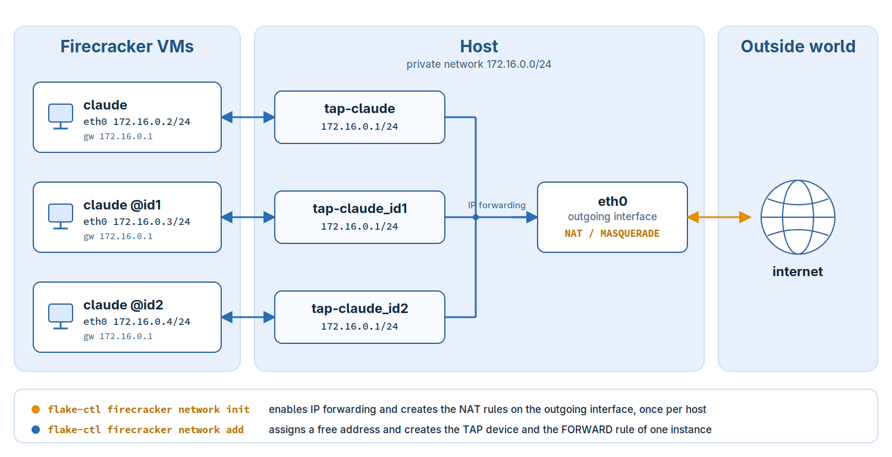

.. _firecracker-networking:

======================
Firecracker Networking
======================

.. hint:: **Abstract**

   This chapter explains how a Firecracker VM application is
   connected to the outside world, which commands create and delete
   that setup and how the result looks in the flake configuration.

Firecracker connects a virtual machine to the outside world through a
TUN/TAP device only. Such a device is a host local endpoint and
provides no connection beyond the host by itself. Routing its traffic
further is the task of the host. ``flake-pilot`` implements this as a
NAT based setup with statically assigned addresses. It is created and
deleted with the ``flake-ctl firecracker network`` commands, no
manual setup is needed.

The setup works within the following requirements:

* ``initrd_path`` must be set in the flake configuration.

* The used initrd has to provide support for
  ``systemd-(networkd, resolved)`` and must have been created by
  ``dracut`` such that the passed ``boot_args`` in the flake setup
  will become effective.

The Concept
===========

All VM applications of a host live in one private network which does
not exist outside of that host:

* Private network: ``172.16.0.0/24``
* Gateway, the host side of the network: ``172.16.0.1``
* Netmask: ``255.255.255.0``
* Name server: ``8.8.8.8``
* Name of the network interface in the guest: ``eth0``

These values are compiled into ``flake-ctl`` and are not
configurable. Only the address of an application is variable. It is
assigned once, when the application is connected, and is written to
its flake configuration. Therefore an application keeps its address
across calls and across reboots of the host until it is disconnected
again. The address handed out is the lowest one of the private
network which is not used by another flake registration, addresses of
applications which were disconnected are handed out again.

Every instance of an application has its own address and its own TAP
device. The host side of each TAP device carries the gateway address,
the guest side is configured by the kernel of the VM from the ``ip=``
option on its commandline. No DHCP server is involved:

The traffic of an instance takes the following path:

1. The kernel of the VM configures ``eth0`` statically from its
   commandline and routes everything to the gateway ``172.16.0.1``,
   which is the host side of the TAP device the instance is connected
   to

2. IP forwarding on the host passes the packet from the TAP device on
   to the outgoing interface. One ``FORWARD`` rule per TAP device
   allows this

3. The NAT rule of the outgoing interface rewrites the sender address
   to the address of that interface. On the network of the host the
   traffic of the instance appears as if it would originate from the
   host itself

4. The answers are recognized by connection tracking and are routed
   back to the TAP device the connection came from. As all TAP
   devices carry the same gateway address, and with it the same
   route to the private network, a host route of the form
   ``172.16.0.3/32 dev tap-claude_id1`` per instance makes sure the
   packets are delivered to the device the instance is connected to

.. note::

   The instances share the private network but they are not connected
   to each other. There is no route between two TAP devices, the only
   peer of an instance is the host.

.. note::

   Only the address in the flake configuration is persistent. IP
   forwarding, the netfilter rules and the TAP devices are runtime
   state of the host, after a reboot they have to be created again.

The Commands
============

Prepare the Host
----------------

.. code-block:: bash

   flake-ctl firecracker network init --outgoing-interface eth0

Enables IP forwarding and creates the NAT rules on the given
interface, the one the traffic of the VMs leaves the host through.
This is done once per host, and again after a reboot, not once per
application. The interface is recorded such that the following
commands know where to route the traffic to.

.. warning::

   Please check which tool is managing the firewall on your host and
   refer to its documentation on how to set up the NAT/postrouting
   rules. The command assumes there is no other firewall software
   active on your host and serves only as an example setup!

Connect an Application
----------------------

.. code-block:: bash

   flake-ctl firecracker network add --app $HOME/bin/claude

Assigns a free address to the application, writes the network setup
to its flake configuration, creates its TAP device, connects that
device to the outgoing interface and routes the address of the
application to it.

As every instance needs its own address and its own TAP device, the
command has to be called for each selector the application is called
with:

.. code-block:: bash

   flake-ctl firecracker network add --app $HOME/bin/claude --instance @id1

Disconnect an Application
-------------------------

.. code-block:: bash

   flake-ctl firecracker network remove --app $HOME/bin/claude

Deletes the TAP device, its forwarding rule and the network setup in
the flake configuration. The address becomes free for another
application. Called with ``--instance`` only the setup of that
instance is deleted. The host setup of the ``init`` command is shared
by all applications and stays in place.

.. note::

   The application is left without an ``ip=`` option, which is the
   same state a registration with the ``--no-net`` option creates. If
   the VM should fall back to a dynamic setup, ``ip=dhcp`` has to be
   added to its ``boot_args`` by hand.

All commands change the network configuration of the host and
therefore call the required ``ip`` and ``iptables`` commands through
``sudo``. They can be called more than once: a device, a route or a
rule which is already there is not created twice, and one which is
gone is not deleted again. After a reboot of the host, calling ``init`` and
``add`` again restores the setup with the same addresses.

The Result in the Flake Configuration
=====================================

The flake configuration for the registered ``claude`` app from
:ref:`vm-example-claude` can be found at:

.. code-block:: bash

   vi ~/.config/flakes/claude.yaml

Connecting the app and its instances leads to the following network
related settings:

.. code-block:: yaml

   vm:
     runtime:
       firecracker:
         boot_args:
           - ip=172.16.0.2::172.16.0.1:255.255.255.0::eth0:off
           - rd.route=172.16.0.1/24::eth0
           - nameserver=8.8.8.8
         instance:
           "@id1":
             boot_args:
               - ip=172.16.0.3::172.16.0.1:255.255.255.0::eth0:off
           "@id2":
             boot_args:
               - ip=172.16.0.4::172.16.0.1:255.255.255.0::eth0:off

With this setup ``claude`` boots with the static IP 172.16.0.2,
``claude @id1`` with 172.16.0.3 and ``claude @id2`` with 172.16.0.4.
For further information about the network setup options, refer to
``man dracut.cmdline`` and look up the section about ``ip=``.

The instance settings do not replace the global ``boot_args`` but are
merged into them: an option which is also set in the ``instance``
section takes the place of the global setting of the same option,
options which are not set globally are appended. In the example above
only the ``ip=`` option is exchanged, ``rd.route=`` and
``nameserver=`` stay in effect for all instances.

.. note::

   The ``@`` character is reserved in YAML, therefore the key has to
   be quoted. For convenience the plain name without the ``@``
   prefix, e.g ``id1``, is accepted as a key as well. Run the app
   with ``PILOT_DEBUG=1`` to see whether an instance section was
   found and which kernel commandline it produced.

.. note::

   The kernel only accepts interface names shorter than 16 characters
   which do not contain ``/``, ``:`` or whitespace. Thus the TAP
   device name is built by replacing all characters outside of
   ``[A-Za-z0-9_]`` by ``_`` and by shortening names that are too
   long. A shortened name keeps the first characters of the app name
   and is made unique again by a hash suffix, e.g the app
   ``some-very-long-application-name`` uses the TAP device
   ``tap-some_bbb9de``. Run the app with ``PILOT_DEBUG=1`` to see the
   TAP device name it expects.
