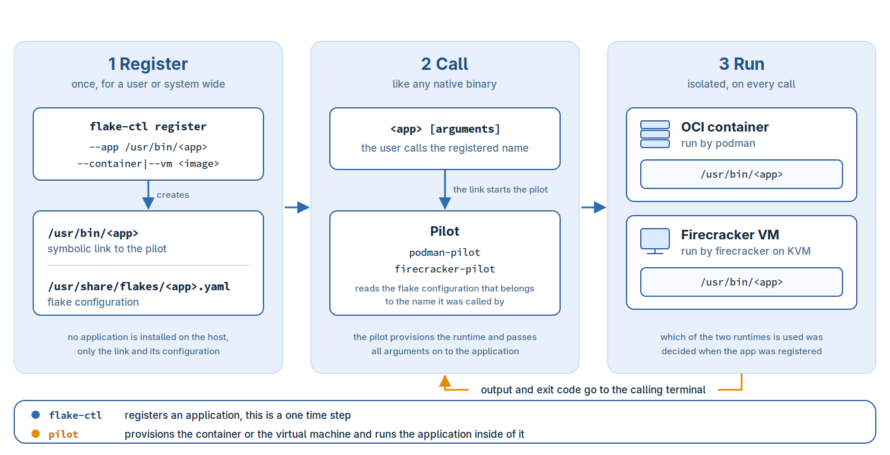

.. Flake Pilot User Guide, master document

=======================
Flake Pilot User Guide
=======================

.. rubric:: Application Isolation - Secure Execution with a Native Feel

Flake Pilot registers, provisions and launches applications that are
not installed on your host but are provided inside a runtime
environment such as an OCI container or a Firecracker virtual machine.
The registered application behaves like any other program on the
system: it is called by its name, it reads and writes the data you
point it to, and it returns its exit code to your shell. Everything
that is needed to run it, the image, the engine and the provisioning
of the instance, is handled behind that name.

An application registered this way is called a **flake**.

About This Guide
================

This guide is written for administrators and developers who want to
provide isolated applications on a Linux host. It explains the
concepts behind flakes, shows how to register applications for the
``podman`` and ``firecracker`` engines, describes the network setup
for virtual machines and documents the layout of the flake
configuration.

The guide is organized as follows:

* :ref:`introduction` explains what Flake Pilot is, which components
  it consists of and which problems it solves.

* :ref:`installation` describes how to install the packages or how to
  build the project from source.

* :ref:`getting-started` prepares the host and registers a first
  application.

* :ref:`container-apps` covers applications provided by OCI
  containers, including delta containers and layered setups.

* :ref:`vm-apps` covers applications provided by Firecracker virtual
  machines.

* :ref:`firecracker-networking` explains how a virtual machine is
  connected to the outside world.

* :ref:`application-setup` documents the registry layout, the flake
  configuration and the tools to inspect a running setup.

* :ref:`building-images` points to ways of building your own
  application images.

* :ref:`troubleshooting` collects known issues and the switches which
  help to analyze them.

The command line of each tool is documented in the manual pages
shipped with the packages, e.g ``man 8 flake-ctl`` or
``man 8 podman-pilot``. This guide references them where the details
matter.

.. toctree::
   :maxdepth: 2
   :caption: Contents
   :numbered:

   introduction
   installation
   getting_started
   container_apps
   vm_apps
   firecracker_networking
   application_setup
   building_images
   troubleshooting

Resources
=========

* Source code and issue tracker:
  https://github.com/OSInside/flake-pilot

* Packages:
  https://build.opensuse.org/package/show/Virtualization:Appliances:Builder/flake-pilot

* Manual pages:
  https://github.com/OSInside/flake-pilot/tree/main/doc

Feedback is very much welcome.
